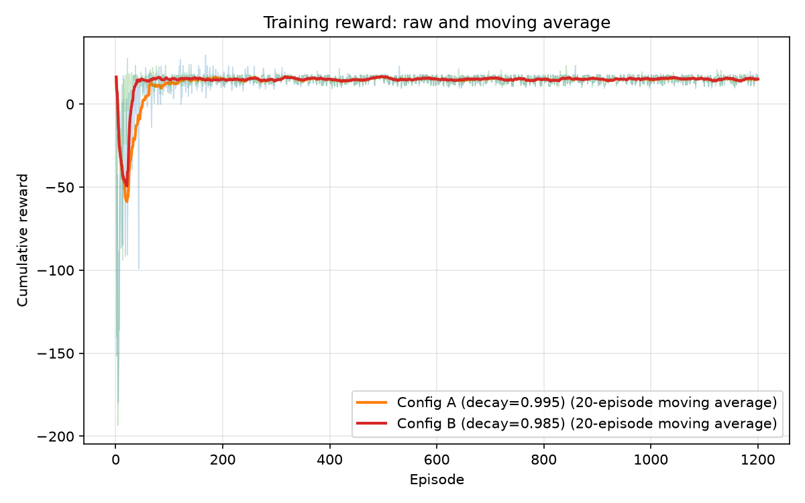
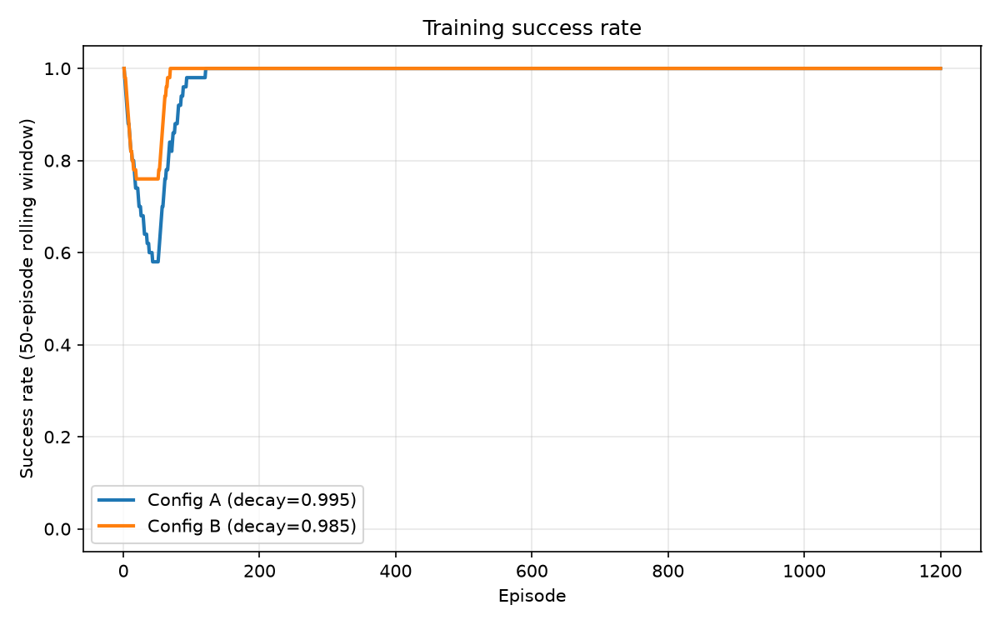
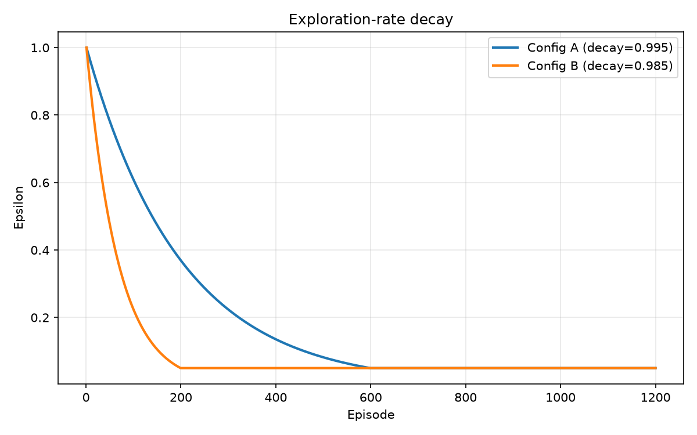
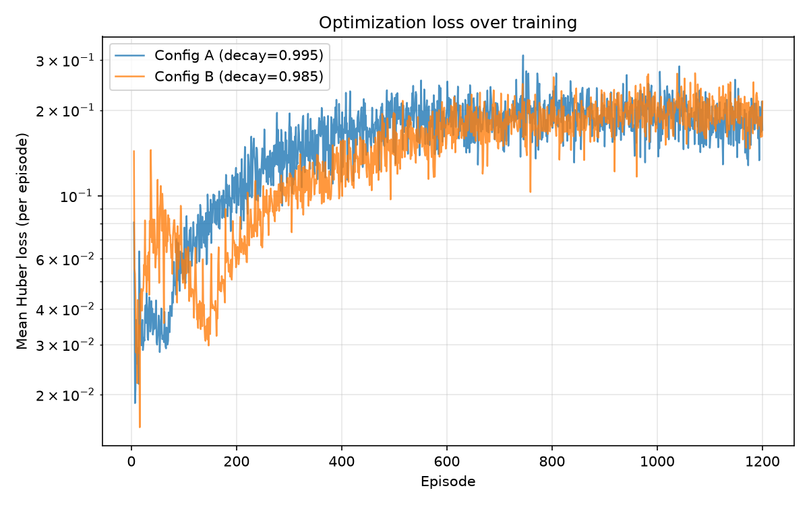
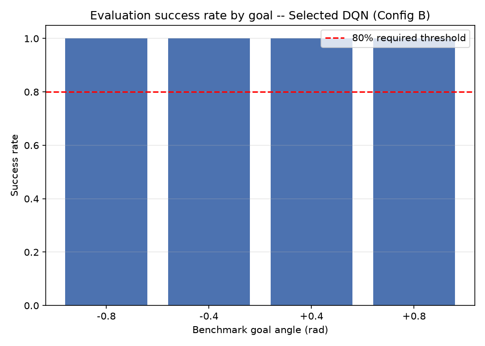

# Deep Q-Network Control of the Unitree G1 Left Elbow

**CSCN8020 — Reinforcement Learning**
**Student:** Liggia Cruz
**Student ID:** 9085905
**Instructor:** Prof. Enrique Espinosa, Conestoga College

---

## 1. Introduction and Connection to the G1 Primer Workshop

The Unitree MuJoCo G1 Primer Workshop built a validated Gymnasium environment,
`G1ElbowTargetEnv`, around the left elbow joint of a fixed-base Unitree G1
humanoid model. That workshop stopped deliberately short of reinforcement
learning: it inspected the raw MuJoCo model, implemented a proportional–
derivative (PD) controller with `qfrc_bias` gravity/Coriolis compensation,
wrapped that controller in a three-action discrete Gymnasium environment, and
validated the environment with a hand-written rule-based policy
(`choose_rule_based_action()` in `src/test_g1_elbow_env.py`).

This assignment picks up at exactly that point. The environment, the PD
controller, and the rule-based baseline are unchanged — they are the fixed
experimental platform described in section 4 of the assignment. The new work
is a complete, student-implemented Deep Q-Network (DQN) agent
(`src/dqn/`) that learns the same three-action decision problem the
rule-based policy solves by hand, trained under two exploration-decay
schedules, evaluated greedily against four benchmark goal angles, and
compared directly against the rule-based baseline on identical episodes.

## 2. Environment Definition

**Environment class:** `G1ElbowTargetEnv` (`src/g1_rl/g1_elbow_env.py`),
unmodified from the primer workshop.

**Observation** (4 values, `float32`):

```
[current_elbow_angle, current_elbow_velocity, goal_angle, goal_angle - current_elbow_angle]
```

**Actions** (discrete, 3 values):

| Action | Meaning |
|---|---|
| 0 | Decrease the internal PD-controller target angle by 0.08 rad |
| 1 | Hold the internal PD-controller target angle |
| 2 | Increase the internal PD-controller target angle by 0.08 rad |

The agent never commands torque directly. It nudges an internal target
angle; a PD controller (`kp=20`, `kd=2` on the controlled joint) plus
`qfrc_bias` compensation converts that target into bounded actuator torque
every physics sub-step (`frame_skip=10` MuJoCo steps per environment step).

**Reward.** At each step, `reward = -|angle_error|`, plus `+1.0` once the
error enters the success tolerance (0.04 rad), minus a small `-0.05`
penalty for changing the target unnecessarily once already inside that
tolerance, plus a `+10.0` terminal bonus on success. This shapes the agent
toward monotonic progress and rewards using `HOLD` once close to the goal.

**Success / termination.** An episode **terminates** when the elbow angle
has stayed within 0.04 rad of the goal for 8 consecutive steps
(`required_success_steps=8`) — `info["is_success"]` and the `terminated`
flag both become `True`. An episode is **truncated** if it reaches 150
steps (`maximum_episode_steps`) without meeting that streak requirement.

**`terminated` vs. `truncated`.** These are not interchangeable. `terminated`
means the task's own success condition was met — a real terminal state with
no meaningful "next return" to bootstrap. `truncated` means the wall-clock
step budget ran out while the task was still ongoing; the underlying MDP did
not end, so bootstrapping from the next state is still the correct target.
This environment's `terminated` flag is used exactly once, on success — there
is no separate failure-terminal state, so `truncated` here always means "ran
out of time without success." Section 4 explains how the replay buffer and
Bellman target encode this distinction.

## 3. Final Q-Network Architecture

`src/dqn/q_network.py` implements the assignment's minimum-required
architecture, used unchanged for both experimental configurations:

```
Input            : 4   (observation vector)
Hidden layer 1   : 64 units, ReLU
Hidden layer 2   : 64 units, ReLU
Output           : 3   (one Q-value per discrete action, no activation)
```

The output layer has no activation function. Q-values are estimates of
expected discounted return, which are real-valued and can be negative (most
rewards in this environment are negative, `-|angle_error|`) — a softmax
would incorrectly constrain them to a probability simplex. Weight
initialization uses PyTorch's default `nn.Linear` initialization
(Kaiming-uniform), which is already appropriate for ReLU networks of this
depth; no custom initialization was needed for stable training at this
scale. The network runs on CPU throughout (`torch.device("cpu")`); CUDA was
detected as unavailable on the training machine and was not required.

## 4. Replay Buffer and Target-Network Methodology

**Replay buffer** (`src/dqn/replay_buffer.py`). A fixed-capacity
(`50,000` transitions) deque-backed buffer storing `(state, action, reward,
next_state, terminated)` tuples. Sampling draws a uniform-random mini-batch
without replacement and converts it directly to `torch` tensors of the
correct dtype and shape (`float32` states, `int64` actions, `float32`
rewards/terminated flags, each batched to `[batch_size, ...]`).

The critical design choice is storing **`terminated`, not a combined
`done = terminated or truncated`**. If `done` had been used instead, every
transition at the 150-step time limit would have incorrectly told the
Bellman target "there is no future" — even though the arm might have been
mid-approach to the goal. Keeping `terminated` separate means truncated
transitions still bootstrap correctly (see section 5).

**Target network** (`src/dqn/agent.py`). `DQNAgent` holds two structurally
identical `QNetwork` instances: an online network, updated by gradient
descent every optimization step, and a target network, initialized as an
exact copy of the online network (`target_network.load_state_dict(online_network.state_dict())`)
and then held fixed except for periodic hard copies every
`target_update_interval=250` optimizer steps. The target network is never
touched by `loss.backward()` — it only supplies the `max_a' Q(s', a')` term
used to build the regression target. Without this second, slow-moving
network, the target and the prediction would be produced by the same
weights, so every gradient step would chase a target that moved with it,
which is the classic source of DQN divergence.

## 5. Bellman Target and Loss Formulation

For a sampled transition `(s, a, r, s', terminated)`, `optimize_model()`
computes:

```
predicted = Q_online(s)[a]
target    = r + gamma * max_a' Q_target(s', a') * (1 - terminated)
loss      = HuberLoss(predicted, target)
```

`gamma = 0.95` (required baseline value). The `(1 - terminated)` mask is
where the terminated/truncated distinction from section 2 and 4 becomes
concrete: it is computed from `terminated` alone, so a truncated-but-not-
terminated transition still has `terminated == 0` and still bootstraps from
`Q_target(s')`. Only a genuine success termination zeroes the bootstrap
term. The target is computed inside `torch.no_grad()` so gradients never
flow into the target network, and `.detach()` is implicit through that
context — the target is a fixed number for the purposes of this gradient
step. The loss is `nn.SmoothL1Loss` (Huber loss): quadratic for small
errors, linear for large ones, which limits the size of any single gradient
update coming from an outlier TD-error — useful early in training when
Q-value estimates are still far from correct. Gradients are clipped to a
max norm of 10.0 (`nn.utils.clip_grad_norm_`) before the optimizer step, as
an additional stability safeguard (used, per section 5.2 item 12, "if
necessary" — it did not appear strictly necessary for this small a network
on this task, but was kept as cheap insurance). The optimizer is Adam,
learning rate `0.001` (required baseline value).

## 6. Exploration Strategy

Action selection (`DQNAgent.select_action`) is epsilon-greedy: with
probability `epsilon` a uniformly random action is drawn; otherwise the
action with the highest online-network Q-value is taken. `epsilon` starts
at `1.00`, decays multiplicatively by a per-episode factor after every
training episode, and is floored at `epsilon_min = 0.05`. Two decay
factors were compared as the required parameter study (section 8 of this
report). Evaluation always uses `epsilon = 0.0` — the policy is fully
greedy, with no exploration, matching the assignment's evaluation
requirement. All action-selection randomness uses a dedicated
`numpy.random.Generator` seeded independently from the environment's own
`np_random`, so exploration decisions are reproducible without perturbing
the environment's own goal-sampling sequence.

## 7. Training Methodology and Reproducibility

**Seeding.** `dqn/utils.py: set_global_seed(seed)` seeds Python's `random`,
NumPy, and PyTorch (`torch.manual_seed` / `torch.cuda.manual_seed_all`) at
the start of every training and evaluation run. The Gymnasium environment
is seeded once, at the very first `env.reset(seed=seed)` call; every
subsequent `reset()` continues drawing from that same seeded generator, so
the full sequence of sampled training goal angles is reproducible from
`--seed` alone. Both required configurations were trained with `seed=42`;
evaluation runs used `seed=123` for the action-selection RNG (evaluation is
otherwise deterministic, since `epsilon=0.0`).

**Warm-up.** No optimization step is taken until the replay buffer holds at
least `500` transitions (`--warmup-transitions`, required baseline value),
so early mini-batches are not drawn from a buffer of only a handful of
highly correlated transitions.

**Stop condition.** Training used a dual stop condition: a hard episode cap
(`--max-episodes 1200`) and a wall-clock safety cap (`--max-minutes 45`),
whichever came first. In practice both configurations reached the episode
cap in well under three minutes — the single-joint, headless, no-render
simulation is inexpensive (see Table 1) — so the wall-clock cap was never
the binding constraint.

**Execution.** Training and evaluation both run headlessly (`render_mode=None`),
on CPU (`torch.device("cpu")`); rendering is used only by
`render_dqn_policy.py`, after training, for the demonstration video.

## 8. Results for Both Epsilon-Decay Configurations

Two configurations were trained with every hyperparameter held fixed except
epsilon decay, per section 6 of the assignment:

| Configuration | Epsilon decay | Purpose |
|---|---|---|
| A — Baseline | 0.995 | Longer exploration period |
| B — Faster decay | 0.985 | Earlier transition toward exploitation |

**Table 1 — Training comparison**

| Metric | Config A (0.995) | Config B (0.985) |
|---|---|---|
| Total training episodes | 1200 | 1200 |
| Wall-clock training time | 2.63 min | 2.09 min |
| Final epsilon | 0.0500 | 0.0500 |
| Mean cumulative reward, final 20 episodes | 15.00 | 15.11 |
| Mean cumulative reward, final 50 episodes | 14.82 | 14.94 |
| Reward std. dev., final 50 episodes | 2.20 | 2.08 |
| Training success rate, final 50 episodes | 100% | 100% |
| Episode where 50-ep rolling success first ≥ 90% | 80 | 59 |
| Final greedy evaluation success rate (20 episodes) | 100% (20/20) | 100% (20/20) |
| Mean evaluation reward (20 episodes) | 13.20 | 13.11 |

**Observations.** Both configurations converge to a stable, high-reward
policy and both reach the full 100% required benchmark success rate — the
task is simple enough (a single joint, a bounded three-action space, and a
dense, well-shaped reward) that either exploration schedule eventually
finds it. The two configurations differ in *how fast* and *how smoothly*
they get there, not in their final outcome. Figure 1 shows Config B's
faster recovery from the initial random-policy reward trough; Figure 2
shows the same effect in rolling training success rate — Config B crosses
90% rolling success at episode 59, roughly 25% sooner than Config A's
episode 80. Config B also ends training with marginally lower reward
variance in its last 50 episodes (2.08 vs. 2.20), suggesting a slightly
more settled policy by the time exploration bottoms out. Neither
configuration showed instability, divergence, or oscillating loss at any
point in training (Figure 4).

## 9. Required Plots and Evaluation Tables

All plots referenced below are produced by `src/generate_plots.py` and are
included in `results/plots/`:

**Figure 1** — raw and 20-episode moving-average training reward for both
configurations.



**Figure 2** — 50-episode rolling training success rate for both
configurations.



**Figure 3** — epsilon over training episodes for both configurations.



**Figure 4** — mean per-episode Huber loss (log scale) for both
configurations.



**Figure 5** — greedy evaluation success rate per benchmark goal for the
selected configuration, with the 80% required threshold marked.



**Table 2 — Final evaluation table (selected configuration: Config B)**

| Goal | Episodes | Successes | Success rate | Mean reward |
|---|---|---|---|---|
| −0.8 rad | 5 | 5 | 100% | +10.754 |
| −0.4 rad | 5 | 5 | 100% | +15.398 |
| +0.4 rad | 5 | 5 | 100% | +15.419 |
| +0.8 rad | 5 | 5 | 100% | +10.878 |
| **Overall** | **20** | **20** | **100%** | **+13.112** |

The 80% required threshold (section 3.5 of the assignment) is exceeded at
every individual benchmark goal, not only in aggregate.

## 10. Comparison with the Rule-Based Baseline

Both policies were evaluated on the identical benchmark protocol (four
goals, five episodes each, `seed=123`, `epsilon=0.0` for the DQN):

**Table 3 — Rule-based vs. selected DQN**

| Metric | Rule-based policy | Selected DQN (Config B) |
|---|---|---|
| Successes / 20 | 20 | 20 |
| Success rate | 100% | 100% |
| Mean cumulative reward | 12.87 | 13.11 |
| Mean episode length | 24.0 steps | 19.5 steps |
| Mean final absolute error | 0.0122 rad | 0.0123 rad |
| Main qualitative behaviour | Monotonically drives the internal target toward the goal in fixed 0.08 rad steps, then holds; deterministic and identical across seeds | Learns a comparable drive-then-hold policy; reaches the success streak in fewer steps on average |

**Discussion.**

- **Sample efficiency.** The rule-based policy needs zero training
  episodes — it is hand-derived. The DQN needed on the order of 60–80
  episodes (a few thousand environment steps) before its rolling success
  rate reached 90%. For this task, the rule-based policy is strictly more
  sample-efficient, because the task's structure (move target toward goal,
  then hold) was simple enough for a human to write down directly.
- **Stability near the goal.** Both policies show low final absolute error
  (~0.012 rad, well inside the 0.04 rad tolerance) and neither showed
  meaningful oscillation once inside the success region — the reward's
  `-0.05` penalty for changing the target while already close to the goal
  appears to have taught the DQN to prefer `HOLD` there, matching the
  rule-based policy's explicit tolerance check.
- **Generalization across goals.** The DQN was evaluated at all four
  benchmark angles, including two (±0.8 rad) it was never given as a *fixed*
  goal during training — during training, goals were sampled continuously
  from `[-0.8, 0.8]`, so ±0.8 rad are the extreme edges of that range. It
  reached 100% success at both edges, indicating it learned the underlying
  angle-error-driven decision rule rather than memorizing a small set of
  goals.
- **Use of HOLD.** The DQN's mean episode length (19.5 steps) is shorter
  than the rule-based policy's (24.0 steps) at the same tolerance and streak
  requirement, which suggests the learned policy reaches the required
  8-step success streak slightly faster on average, rather than that it
  under-uses `HOLD` — an under-use of `HOLD` would instead show up as
  longer episodes or lower success, neither of which occurred.
- **Why might a hand-written policy match or outperform a learned one
  here?** This task has a small, fully observed state (4 values), a dense
  and well-shaped reward, and an obvious monotonic control strategy — every
  property that makes a problem *easy* to solve by direct human reasoning
  and by function approximation alike. DQN's advantage over hand-written
  control shows up on problems where the right rule is not obvious to a
  human (high-dimensional state, sparse reward, non-monotonic dynamics);
  this elbow-targeting task does not have those properties, so the two
  approaches converge to essentially the same behaviour rather than the
  learned policy clearly surpassing the hand-written one.

## 11. Discussion of Failures, Oscillation, Stability, and Generalization

No training run failed to converge, and no evaluation episode failed
(0 failures across 40 total evaluation episodes across both configurations).
No sustained oscillation was observed in the loss curves (Figure 4) or in
the per-step action logs produced by `render_dqn_policy.py` — once within
tolerance, the learned policy predominantly selects `HOLD`, consistent with
the shaped reward's small penalty against unnecessary target changes near
the goal. The one place both configurations show visible instability is the
expected one: the first ~20–50 episodes, while epsilon is still near 1.0 and
the replay buffer is dominated by near-random transitions, cumulative reward
dips sharply (to roughly −50 to −190) before recovering (Figure 1). This is
the expected signature of early exploration-driven policy noise, not of an
optimization problem — it resolves as epsilon decays and the buffer fills
with more on-policy transitions.

## 12. Evidence-Based Recommendation

**Config B (epsilon decay = 0.985) is selected** as the final DQN. Both
configurations satisfy the 80% success threshold with an actual result of
100%, so the tie-breaker is the evidence the assignment specifically asks
for: stability, training time, and consistency, not peak reward alone.
Config B (a) reaches a 90%+ rolling training success rate roughly 25%
sooner (episode 59 vs. 80), (b) ends training with slightly lower reward
variance in its final 50 episodes, and (c) trains in slightly less
wall-clock time. Config A is not a poor result — it converges to the same
final performance — but Config B reaches that performance with a shorter,
slightly steadier exploration phase, which is the outcome a faster
exploration decay is intended to produce on a task this simple.

## 13. Limitations and Proposed Future Improvements

- **Task simplicity limits what this comparison can show.** Because the
  single-joint task is solvable almost as well by a hand-written policy,
  this experiment does not stress-test DQN's main advantages (handling
  high-dimensional or partially observed state, discovering non-obvious
  strategies). A natural extension is a second joint or a partially
  observed variant of the task, where a hand-written rule becomes
  impractical to derive.
- **No Double DQN / Dueling DQN.** The assignment scope required a single
  online/target network pair with a standard max-based bootstrap; this can
  overestimate Q-values. A Double DQN target
  (`Q_target(s', argmax_a' Q_online(s', a'))`) would be a natural next step
  to check whether overestimation is affecting this task at all.
- **Single random seed per configuration.** Both configurations were
  trained with one seed (42). Given the small variance already observed,
  results are likely robust, but a multi-seed comparison (3–5 seeds per
  configuration) would let the epsilon-decay comparison in section 8 report
  confidence intervals rather than single-run point estimates.
- **Fixed network size.** The required 64-64 architecture was used
  unchanged; given how quickly and cleanly this task converges, a smaller
  network was not explored but might train even faster without loss of
  performance.

---

## Appendix A — Reproducing These Results

Exact commands are documented in the project `README.md`, "DQN Assignment"
section. In summary:

```bash
source .venv/bin/activate
cd src
python train_dqn.py --config-name config_a --seed 42 --epsilon-decay 0.995 --max-episodes 1200 --max-minutes 45
python train_dqn.py --config-name config_b --seed 42 --epsilon-decay 0.985 --max-episodes 1200 --max-minutes 45
python evaluate_dqn.py --checkpoint ../models/config_a_dqn.pt --seed 123
python evaluate_dqn.py --checkpoint ../models/config_b_dqn.pt --seed 123
python evaluate_rule_based.py
python generate_plots.py --selected-config-eval-csv ../results/config_b_dqn_evaluation.csv --selected-config-label "Selected DQN (Config B)"
```
